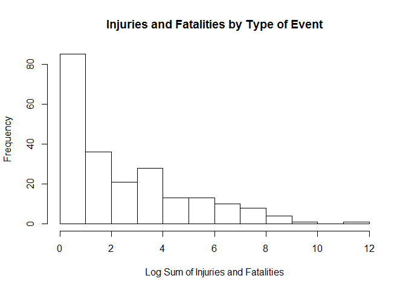
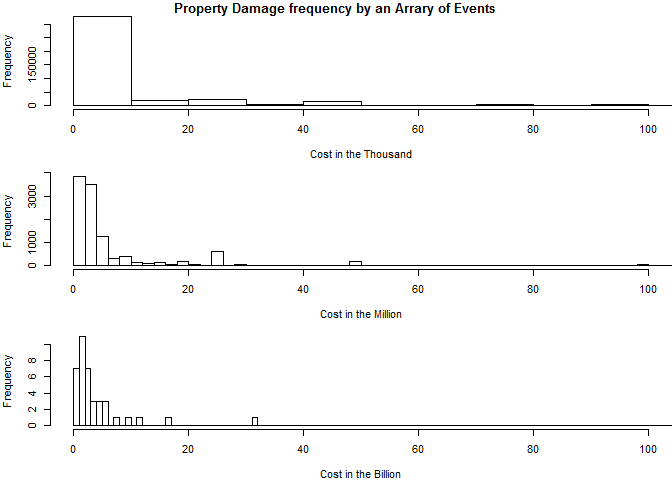

Jacinto  
March 26, 2016  
# Using NOAA Storm Database Determine Most Harmful Events and the Greatest Economic Consequences
#### Synopsis:
Storms and other severe weather events can cause both public health and economic problems for communities and municipalities. Many severe events can result in fatalities, injuries, and property damage, and preventing such outcomes to the extent possible is a key concern.

This project involves exploring the U.S. National Oceanic and Atmospheric Administration's (NOAA) storm database. This database tracks characteristics of major storms and weather events in the United States, including when and where they occur, as well as estimates of any fatalities, injuries, and property damage.

## Data Processing Description
1. Data was unzipped and read into a R table
2. Aggregated fatalities and injuries to create total grouped by EVTYPE
3. Summarized the most harmful with respect to population by finding the max and displaying histogram
4. Sperated property damage based on three bracket: thousand, million, and billion.
5. Determine the greatest economic consequence by finding the mean of EVTYPE in the subset of billion.
6. Display damage in histogram for a different point of view. 

## Loading and preprocessing the data

```r
## Unzip file and then readed into a table. Result is cached
df <- read.csv(bzfile("repdata-data-StormData.csv.bz2"))

## Types of events most harmful with respect to population
totalByEvent <- with(df, aggregate(cbind(FATALITIES, INJURIES) ~ EVTYPE, FUN=sum, na.rm=TRUE))
totalByEvent$total <- apply(totalByEvent[,2:3], MARGIN=1, FUN=sum, na.rm=TRUE)
totalNoZero <- subset(totalByEvent, total > 0, select=total)

## Types of events with the greatest economic consequences
## Seperate the property damage by brackets: Thousand, Million, and Billion. 
dmgThousand <- subset(df, PROPDMGEXP %in% c('k', 'K'), select=c(EVTYPE,PROPDMG))
dmgMillion <- subset(df, PROPDMGEXP %in% c('m', 'M'), select=c(EVTYPE,PROPDMG))
dmgBillion <- subset(df, PROPDMGEXP %in% c('b', 'B'), select=c(EVTYPE,PROPDMG))
```

## Results
### Across the United States, which types of events(as indicated in the EVTYPE variable) are most harmful with respect to population health?

```r
summary(totalNoZero$total)
```

```
##     Min.  1st Qu.   Median     Mean  3rd Qu.     Max. 
##     1.00     1.75     5.00   707.60    44.25 96980.00
```
Due note that zero entries were removed to create the summary above. 

```r
mostHarmful <- as.character(totalByEvent[which.max(totalByEvent$total),1])
mostDmg <- max(totalByEvent$total)
```
The most harmful event is TORNADO with a total of 9.6979\times 10^{4} number of fatalities and injuries. 


```r
## Histogram showing frequency of human damage by events. While zeros are removed. 
numberOfZeros <- sum(totalByEvent$total == 0)
totalEntry <- dim(totalByEvent)[1]
hist(log(totalNoZero$total), xlab="Log Sum of Injuries and Fatalities", main="Injuries and Fatalities by Type of Event")
```



Majority of the entries were zero so they are removed to uncovered the more interesting histogram. There are 765 number of zeros while the total number of entries is 985.
The histogram shows that majority of the events aren't very dangerous with very few damage to people. However there are a few events that causes major damage and are skewed to the right. However, these event do not happen as much. 

### Across the United States, which types of events have the greatest economic consequenes?

```r
avgDmgBillion <- with(dmgBillion, aggregate(PROPDMG ~ EVTYPE, FUN=mean, na.rm=T))
avgDmgBillion <- avgDmgBillion[order(avgDmgBillion$PROPDMG, decreasing = T),]
first <- avgDmgBillion[1,]
second <- avgDmgBillion[2,]
```
On average the event with the most impact is FLOOD with damage estimated at 24.5 Billion. In second place is STORM SURGE with damage estimated at 21.28. 


```r
## Histogram of property damage by cost brackets in the Thousands, Millions, and Billions. 
par(mfrow=c(3,1),mar=c(4,4,1,0))
hist(dmgThousand$PROPDMG, xlim=c(0, 100), breaks=500, xlab="Cost in the Thousand", main="")
hist(dmgMillion$PROPDMG, xlim=c(0, 100), breaks=500, xlab="Cost in the Million", main="")
hist(dmgBillion$PROPDMG, xlim=c(0, 100), breaks=100, xlab="Cost in the Billion", main="")
title("Property Damage frequency by an Arrary of Events", line = -1, outer=T)
```



The histogram summarize all the events damage in the united states in three bracket. It shows that most event causes damage in the thousands and there a signifciant less events that goes into the billions. 
